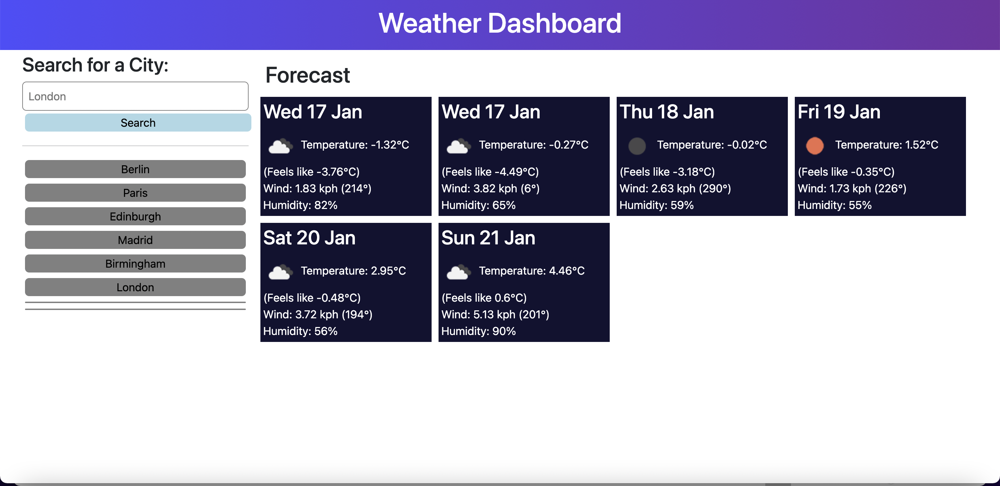

# Unit 8 Server-Side APIs: Weather Dashboard

## Description

Weather Dashboard - A weather dashboard allowing you to look at the weather for mutiple cities

## Deployed Link

[Weather Dashboard](https://jkp1990.github.io/Module-8-Server-Side-APIs-Weather-Dashboard/)

## Screenshot

## Usage

You would need to enter the city in order to display the weather

## Credits

n/a

## License

License is MIT
